# ADTD Modern 3.0

*Designed and developed by **Shenuka Fernando***

**A free-to-use Active Directory diagram tool and security assessment: the modern replacement for Microsoft's Active Directory Topology Diagrammer (ADTD), rebuilt for Windows Server 2016–2025, with a Microsoft Entra ID (Azure AD) hybrid upgrade plan.**

Use it to document your AD forest (sites, replication, domains, trusts, OUs, GPOs, DFS-R and Exchange) as draw.io or Visio diagrams, run an Active Directory security health check, and plan a move to hybrid identity with Entra Connect. It is a read-only PowerShell tool with a Windows app and an MSI installer.

ADTD Modern reads your Active Directory, draws it in **draw.io**, and writes an **assessment report**. It works with draw.io desktop or draw.io on the web, both free. Visio is optional.

The drawings cover sites, replication, domains and trusts, OUs and GPO links, DFS-R, Exchange, and a target hybrid topology. Every finding in the report comes with evidence, why it matters, step-by-step fixes and Microsoft references. The report also includes a hybrid readiness gap analysis and a four-phase upgrade roadmap.

It replaces Microsoft's **Active Directory Topology Diagrammer** (`ADTD.Net_Setup.msi`, 2011). That tool stopped at Windows Server 2008 R2, Exchange 2010 and Visio 2003–2010, and needs .NET 2.0.

> ADTD Modern is a new implementation. It contains no code from the original tool and is not a Microsoft product. It is **read-only**: it only runs LDAP searches, never changes Active Directory, and works with an ordinary domain user account.

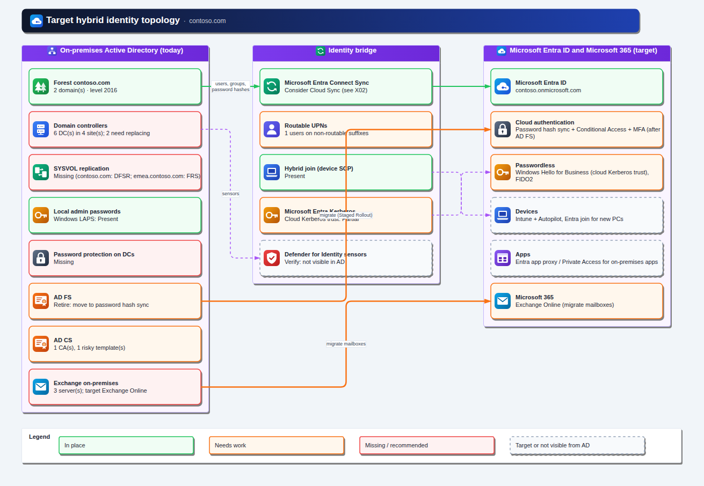

## Contents

- [Compatibility](#compatibility)
- [Tested in a lab](#tested-in-a-lab)
- [Quick start](#quick-start)
- [The app](#the-app)
- [What's new compared with ADTD 2011](#whats-new-compared-with-adtd-2011)
- [What it draws](#what-it-draws)
- [The assessment report](#the-assessment-report)
- [Security checks](#security-checks)
- [Hybrid Entra ID readiness and upgrade roadmap](#hybrid-entra-id-readiness-and-upgrade-roadmap)
- [draw.io desktop, draw.io web, or Visio](#drawio-desktop-drawio-web-or-visio)
- [Supported versions](#supported-versions)
- [Command reference](#command-reference)
- [Output files](#output-files)
- [Repository layout](#repository-layout)
- [Known limitations](#known-limitations)
- [Licence](#licence)

Guides: [Installation](docs/INSTALL.md) · [**Offline / domain-joined machines**](docs/OFFLINE.md) · [Usage](docs/USAGE.md) · [Findings catalog (58 checks)](docs/FINDINGS.md) · [Hybrid identity plan](docs/HYBRID.md) · [Development](docs/DEVELOPMENT.md) · [Changelog](CHANGELOG.md)

## Compatibility

| | Supported |
|---|---|
| **Run ADTD on** | Windows Server **2016, 2019, 2022, 2025** and Windows **10 / 11** (64-bit) |
| **PowerShell** | **Windows PowerShell 5.1** (built into Windows; the app `ADTD.exe` uses it) and **PowerShell 7.4, 7.5 and 7.6 LTS** (`pwsh`). Tested on every change in GitHub Actions: 5.1 and 7 on Windows, 7 on Linux |
| **Older Windows** | Windows Server 2012 / 2012 R2 and 2008 R2 SP1 work only after installing [WMF 5.1](https://learn.microsoft.com/powershell/scripting/windows-powershell/wmf-overview#wmf-availability-across-windows-operating-systems) (not lab-tested). Server 2008 and 2003 can't run it. Easier: run ADTD from a supported machine and point it at the old domain |
| **Domains it can read** | Any AD forest, DCs from **Windows 2000 Server to Windows Server 2025**, forest/domain functional levels 0–10, schema up to 91 (see [Supported versions](#supported-versions)) |
| **Account needed** | An ordinary **domain user**. Admin rights give the same results (checked in the lab) |
| **Other software** | None required: no RSAT or ActiveDirectory module. draw.io desktop or draw.io on the web to view drawings; Visio optional |
| **Internet** | Not needed. See [docs/OFFLINE.md](docs/OFFLINE.md) |

## Tested in a lab

The code in 3.0.4 was tested end to end (as 3.0.3 plus the fixes that make up 3.0.4) on a new **Windows Server 2022** domain controller (single-DC forest, functional level 2016, AD DS, DNS, DFS-R and an Enterprise Root CA). The MSI was installed by hand from a shared folder. ADTD was run from the window twice, as an ordinary domain user and as a Domain Admin, with every drawing and every format, and opened in draw.io on the web. Both runs finished with the same results: 13 findings (3 high), 5 users, 13 CSV files. The fixes found during this testing are in the [changelog](CHANGELOG.md).

| Run finished | Summary page | Target hybrid topology |
|---|---|---|
| 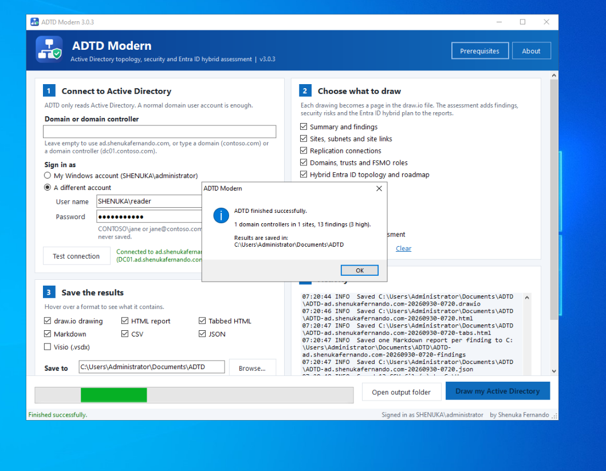 | 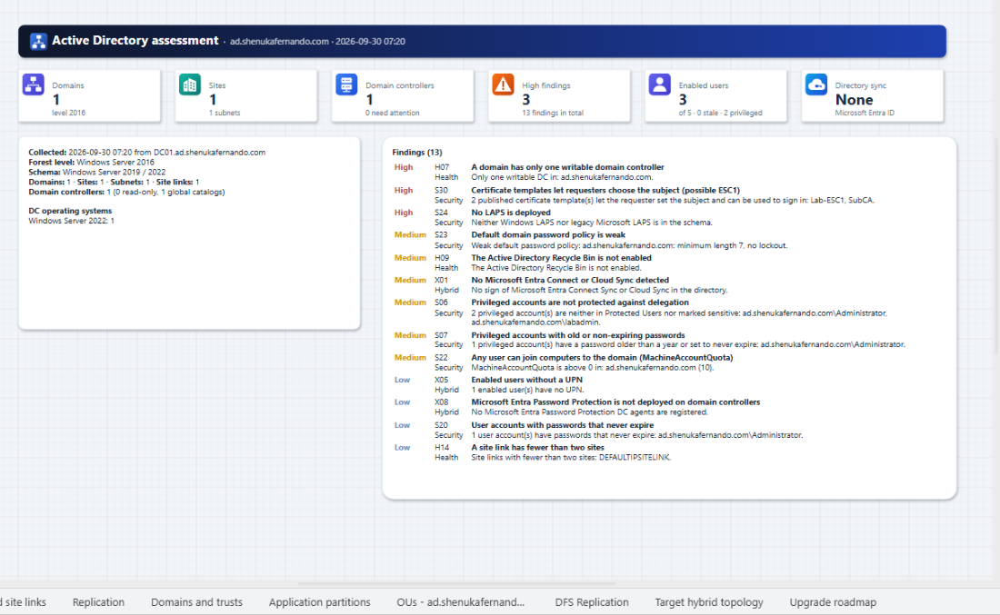 | 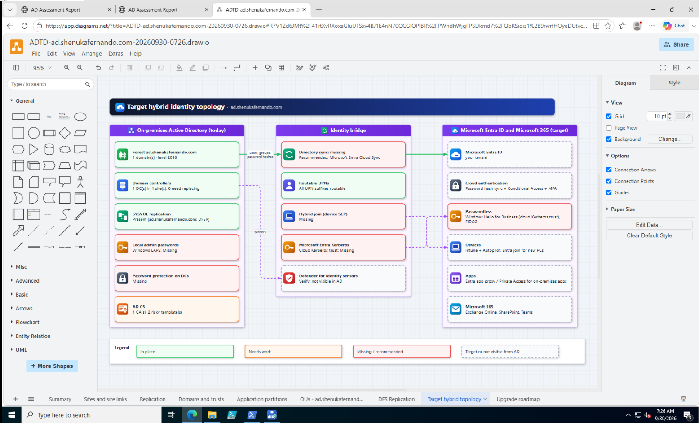 |

Sample outputs from the offline test forest (Contoso, two domains) are in [`samples/`](samples): the drawing, both HTML reports, JSON, per-finding Markdown and the CSV files, including the new `user-summary.csv`.

## Quick start

> **Domain-joined computers without internet access?** Follow [docs/OFFLINE.md](docs/OFFLINE.md): everything works offline, including the report's diagram viewer.

1. **Install.** Download `ADTD_Modern_Setup_3.0.5.msi` (or the offline zip) from the **[latest release](https://github.com/shenukaf69/ADTD-Modern-3.0/releases/latest)** and run it (right-click → Properties → Unblock first). No admin rights? See [option 2](docs/INSTALL.md#option-2-current-user-no-admin-rights).
2. **Prerequisites.** Open **Start → ADTD Modern - Prerequisites** (or **Prerequisites** in the app). It checks the computer, then asks what to install:

   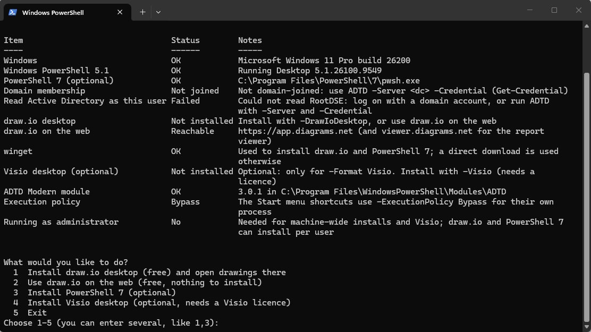

   Choose one or more:
   - **1**: install draw.io desktop
   - **2**: use draw.io on the web (nothing to install)
   - **4**: install Visio desktop (optional, and only if you have a licence)
3. **Run.** After the install, a welcome screen shows where ADTD Modern is installed and offers a **desktop shortcut** and a **taskbar pin**. Open **ADTD Modern**, keep the defaults and click **Draw my Active Directory**. Results go to `Documents\ADTD`, and the report and drawing open automatically.

From PowerShell:

```powershell
Invoke-ADTD -All -Format DrawIo, Html, HtmlTabs, Markdown, Csv, Json -Open
```

## The app

ADTD Modern is a Windows app (`ADTD.exe`) with its own icon on the taskbar, Start menu and desktop. The window walks you through four steps:

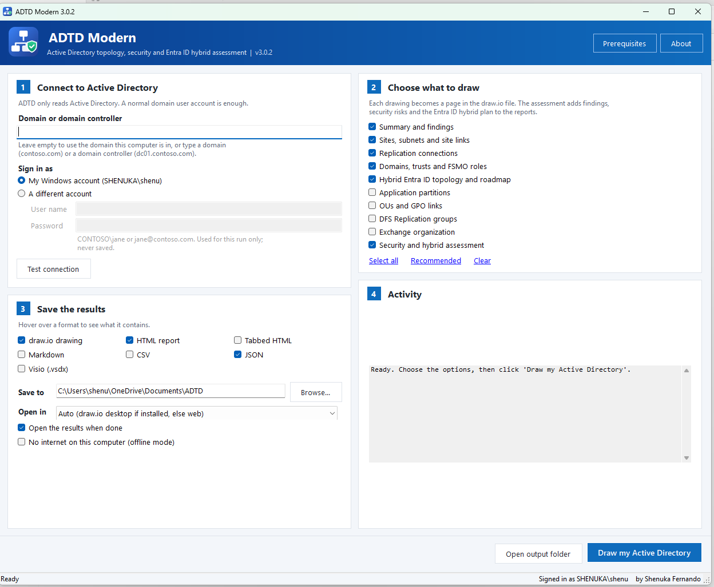

| Step | What you do |
|---|---|
| **1 Connect to Active Directory** | Leave the domain empty for your own domain, or type a domain or DC. **Sign in as** your Windows account or **a different account** (user name and password right in the window, used for this run only). **Test connection** confirms which DC answered |
| **2 Choose what to draw** | Tick the pages and the security and hybrid assessment. **Select all / Recommended / Clear** |
| **3 Save the results** | Formats (draw.io, HTML, tabbed HTML, Markdown, CSV, JSON, Visio), output folder, draw.io desktop or web, offline mode |
| **4 Activity** | Live progress, with a progress bar and status bar |

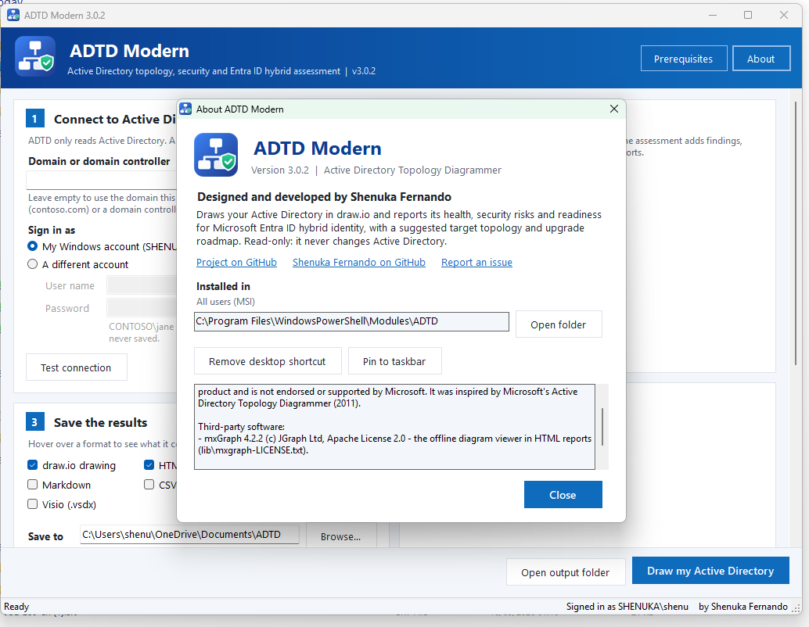

The header has **Prerequisites** (installs draw.io desktop and the rest) and **About**. About shows the version, the author, the **install location** with **Open folder**, buttons to **add a desktop shortcut** and **pin to the taskbar**, and the copyright and third-party notices. See [docs/USAGE.md](docs/USAGE.md#the-window).

## What's new compared with ADTD 2011

| | ADTD 2011 (v1.8) | ADTD Modern 3.0 |
|---|---|---|
| Windows Server | Up to 2008 R2 | 2000 to **2025**, with build, name and end-of-support date for every DC and member computer |
| Functional levels / schema | Up to 2008 R2 | Up to **Windows Server 2025** (level 10, schema 91) |
| Exchange | 2000–2010, routing groups | 2000 to **Exchange Server Subscription Edition**, DAGs, roles by site |
| Drawing tool | Visio 2003–2010 **required** | **draw.io desktop or draw.io web (free)**; Visio 2013+ optional |
| Reports | CSV export | **Assessment report** (single page or **tabbed**), one **Markdown report per finding**, CSV, JSON |
| Health checks | None | 18 health and topology checks |
| Security checks | None | 32 security checks: krbtgt, Tier 0 membership, Kerberoasting, AS-REP roasting, delegation, RC4/DES, LAPS, stale accounts, AD CS ESC1, Seamless SSO key age and more |
| Hybrid identity | None | Detects Entra Connect / Cloud Sync, hybrid join, Seamless SSO, Entra Kerberos, AD FS, Password Protection and UPN readiness; **gap analysis, target topology and 4-phase roadmap** |
| Runtime | .NET Framework 2.0, 32-bit | Windows PowerShell 5.1 or PowerShell 7, 64-bit. No RSAT or ActiveDirectory module needed |
| Interface | WinForms window, command-line switches | App with its own icon, desktop shortcut and taskbar pin, a guided window with a connection test, **and** a PowerShell module (`Invoke-ADTD`) for scripts and scheduled tasks |
| Installer | Visual Studio setup project | 64-bit MSI with upgrades and silent install; per-user install; **prerequisites installer** |
| Tests | None | 149 offline checks against an in-memory forest, run on PowerShell 5.1 and 7 in GitHub Actions |

## What it draws

Each drawing is one page (tab) in the `.drawio` file.

| Page | Shows |
|---|---|
| **Summary** | Tiles for domains, sites, DCs, high findings, enabled users and directory sync; forest facts, DC operating systems, and the top findings |
| **Sites and site links** | Sites with their DCs and subnets. Site links with cost, interval and change notification. Multi-site links, bridges and a legend |
| **Replication** | Connection objects: created by the KCC, created manually, or disabled. Two-headed arrows mean both directions |
| **Domains and trusts** | Forest facts, the domain tree, functional levels, FSMO holders and SYSVOL replication. Forest, external, realm and shortcut trusts, with direction and SID filtering |
| **Application partitions** | DNS and custom partitions, and the DCs that hold them |
| **OUs** (one per domain) | OU tree with GPO links in precedence order: enforced, disabled, missing GPOs and blocked inheritance |
| **DFS Replication** | Replication groups, members, connections and folders |
| **Exchange** | Servers by site, with version (2013 to SE), roles and DAG |
| **Target hybrid topology** | Today's on-premises AD, the identity bridge (sync, UPNs, hybrid join, Entra Kerberos, Defender for Identity) and the Entra ID / Microsoft 365 target. Each box is coloured: in place, needs work, missing, or not visible from AD |
| **Upgrade roadmap** | The four phases with every finding placed in its phase, plus the suggested target topology |

The drawings use a built-in set of flat icons, embedded in the file. They include domain controllers, sites, subnets, forests, domains, Exchange, OUs, GPOs, DFS-R, Entra ID, sync, Defender, LAPS and certificates. The icons look the same in draw.io desktop, draw.io web, the offline report viewer and PNG/SVG/PDF exports, with no stencil libraries or internet access needed.

Domain controllers are coloured by support status. **Green** means supported, **orange** means support ends within 12 months, and **red** means out of support. A dashed border marks a read-only DC.

| Sites and site links | Domains and trusts |
|---|---|
| 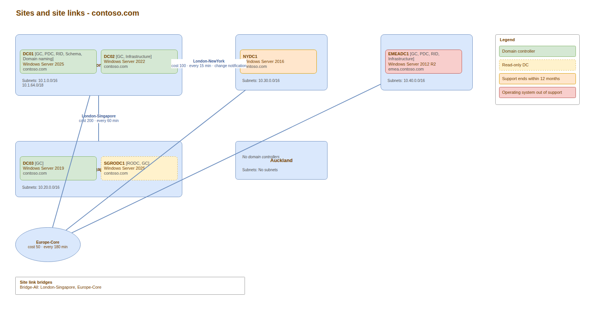 | 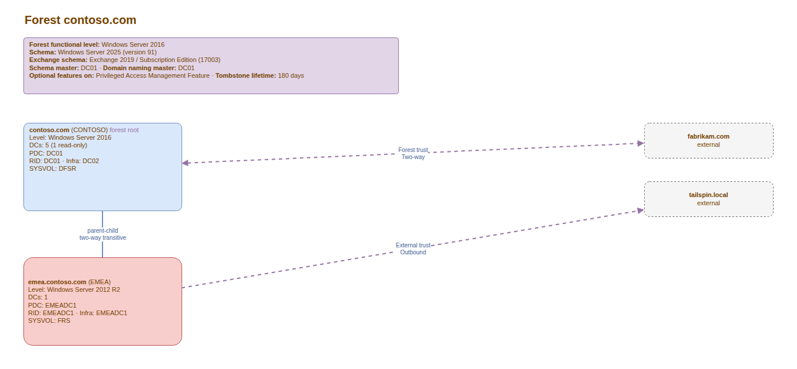 |
| **Replication** | **Upgrade roadmap** |
| 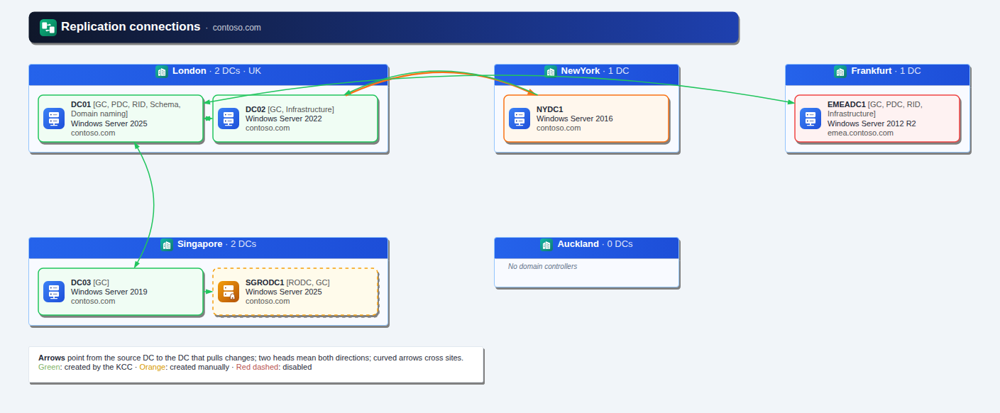 | 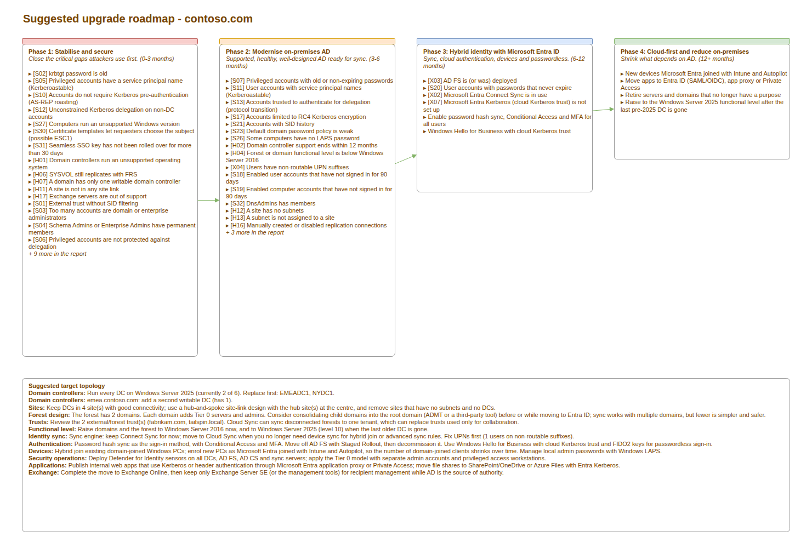 |

The pictures come from the sample forest used by the tests. You can explore the samples yourself:
- [`samples/ADTD-contoso-sample.drawio`](samples/ADTD-contoso-sample.drawio): open it in draw.io.
- [`samples/ADTD-contoso-sample-report-tabs.html`](samples/ADTD-contoso-sample-report-tabs.html): download it and open it in a browser.
- [`samples/findings/`](samples/findings/README.md): browse the per-finding reports on GitHub.

## The assessment report

Every run writes an HTML report. There are two layouts, and you can have both:

- **`Html`** (default): one long page, which is easy to print or save as PDF.
- **`HtmlTabs`** (optional): a single file with tabs:
  - **Summary**
  - **Findings**, with severity and category filters and a search box that also searches affected objects
  - **Diagrams**, with one sub-tab per draw.io page. The built-in viewer works **without internet access**, with zoom and pan
  - **Hybrid plan**
  - **Inventory**

Each finding is a card with:
- **What ADTD found**, with the numbers and names
- **Why it matters**
- **Affected objects**: the full list, also in `finding-evidence.csv`
- **How to fix**, as numbered steps
- **References** to Microsoft Learn and Defender for Identity guidance
- The **roadmap phase** it belongs to

`-Format Markdown` writes the same content as **one Markdown file per finding**, plus an index and `hybrid-plan.md`. These files suit a ticket system, a wiki or Git.

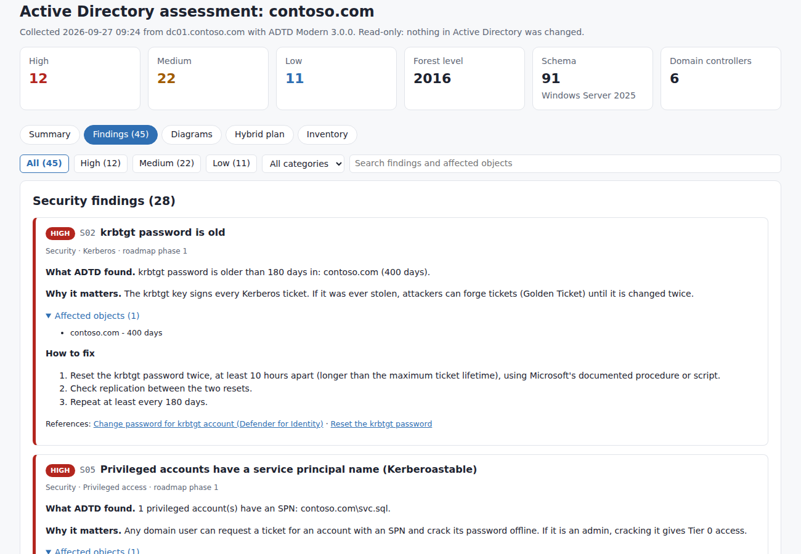

## Security checks

The security scan reads users, computers, groups, AD CS templates and Entra ID-related objects in each domain. It uses one pass per object type, so it is quick even in large domains. You can skip it with `-SkipSecurityScan`.

- **Privileged access:**
  - Domain Admins / Enterprise Admins with more than five members
  - Permanent Schema Admins or Enterprise Admins
  - Admins with SPNs (Kerberoastable)
  - Admins that are not in Protected Users or marked sensitive
  - Old or non-expiring admin passwords, and unused admin accounts
  - Operator groups with members, and DnsAdmins members
- **Kerberos:**
  - krbtgt password age (High after a year)
  - AS-REP roasting (no pre-authentication)
  - Service accounts with SPNs
  - Unconstrained delegation on non-DCs, and protocol transition
  - DES-only accounts
  - RC4-only accounts, which matter because Windows Server updates from July 2026 change the default to AES
- **Accounts:**
  - Password not required, and reversible encryption
  - Stale users and computers (90 days)
  - Passwords that never expire
  - SID history, and an enabled Guest account
- **Domain settings:** MachineAccountQuota, a weak default password policy, and Anonymous or Everyone in Pre-Windows 2000 Compatible Access.
- **Devices:** Windows versions out of support on member computers (Windows 10, Windows 11 22H2 and earlier, Server 2012 R2 and earlier), and LAPS (none, legacy only, or coverage below 95%).
- **Certificate services:** published templates where the requester supplies the subject and the certificate can be used to sign in, with no manager approval (possible ESC1).
- **Hybrid:** Seamless SSO (AZUREADSSOACC) key older than 30 days (High after 90), and RC4 on that account.

The full list, with thresholds, fixes and references, is in [docs/FINDINGS.md](docs/FINDINGS.md). The report also has a **Check by hand** list for settings LDAP can't read: LDAP signing and channel binding, SMB signing, Print Spooler on DCs, NTLMv1, Defender for Identity sensors, backups, PAWs and break-glass accounts.

## Hybrid Entra ID readiness and upgrade roadmap

ADTD looks for the footprint that hybrid identity leaves in Active Directory:

| Detects | How |
|---|---|
| Microsoft Entra Connect Sync (and its server name) | `MSOL_*` / `ADSyncMSA*` accounts and their description |
| Microsoft Entra Cloud Sync | `pGMSA_*` group managed service accounts of the provisioning agents |
| Microsoft Entra hybrid join and your tenant name | Device registration service connection point (`azureADName`, `azureADId`) |
| Seamless SSO | `AZUREADSSOACC` computer account (key age, encryption types) |
| Microsoft Entra Kerberos (cloud Kerberos trust) | `AzureADKerberos` object in each domain |
| AD FS | AD FS DKM container under `CN=Microsoft,CN=Program Data` |
| Entra Password Protection | DC agent service connection points |
| Windows LAPS / legacy LAPS | Schema attributes and per-computer coverage |
| UPN readiness | Enabled users on non-routable suffixes (`.local`, `.lan`, `.corp`, …) or with no UPN |
| Exchange hybrid readiness | Exchange servers, versions and sites |

From this, the report and the **Target hybrid topology** page show:

- **What on-premises AD is missing**: a gap table with the status of each capability (present, partial, missing, or not detectable from AD), the evidence and the recommendation.
- **A suggested target topology**, tailored to the forest. For example:
  - Cloud Sync or Connect Sync, depending on object counts and whether you need device sync
  - Password hash sync with Conditional Access and MFA
  - AD FS retirement through Staged Rollout
  - Hybrid join for existing PCs, and Entra join with Intune and Autopilot for new ones
  - Windows Hello for Business cloud Kerberos trust
  - Defender for Identity sensors
  - Application proxy or Private Access for on-premises apps
  - Consolidating child domains
  - Exchange Online
- **A four-phase roadmap**. Every finding is placed in one of the phases:

  | Phase | Name | Timing |
  |---|---|---|
  | 1 | Stabilise and secure | 0–3 months |
  | 2 | Modernise on-premises AD | 3–6 months |
  | 3 | Hybrid identity with Microsoft Entra ID | 6–12 months |
  | 4 | Cloud-first and reduce on-premises | 12+ months |

Details: [docs/HYBRID.md](docs/HYBRID.md).

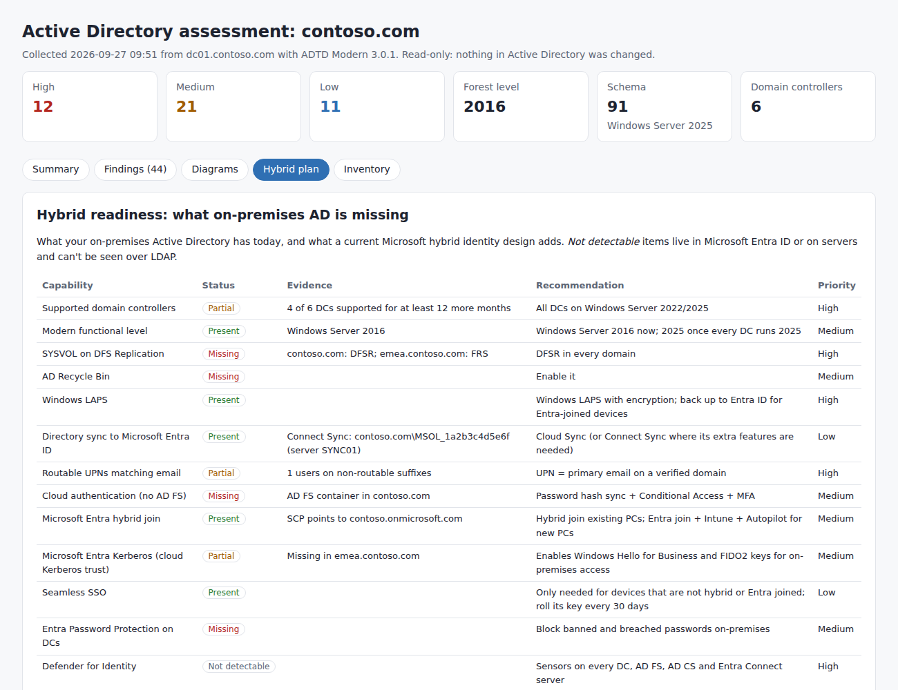

## draw.io desktop, draw.io web, or Visio

| Option | Cost | Install | How ADTD uses it |
|---|---|---|---|
| **draw.io desktop** | Free | `Install-Prerequisites.ps1 -DrawIoDesktop` (winget `JGraph.Draw`, or the signed installer from GitHub) | `-Open` opens the `.drawio` file in the app |
| **draw.io on the web** | Free | Nothing (`-DrawIoWeb` just checks that app.diagrams.net is reachable) | `-Open` opens app.diagrams.net with the drawing inside the link. A `...-open-in-drawio-web.url` shortcut is saved next to it, and the HTML reports show the diagrams with the draw.io web viewer |
| **Visio desktop** | Needs a licence | `Install-Prerequisites.ps1 -Visio` (Office Deployment Tool: Visio Plan 2, or Professional/Standard 2024) | `-Format Visio` draws straight into Visio and saves a `.vsdx` |

Choose the default in the window (**Open drawings in**), or with `-DrawIoViewer Desktop|Web|Auto`. You can also run `Install-Prerequisites.ps1`, which saves your choice.

About the web link: the drawing travels in the URL fragment (`#R…`), which browsers do not send to any server. draw.io decodes it in your browser.

The diagram viewer inside the HTML reports is **built in** (mxGraph, Apache-2.0, bundled in `src/lib`) and works without internet access. Use `-Offline` on computers with no internet access: it also drops the draw.io web links and opens drawings in draw.io desktop. If you'd rather use draw.io's own online viewer in the report, add `-DrawIoWebViewer`. Step-by-step offline guide: [docs/OFFLINE.md](docs/OFFLINE.md).

## Supported versions

| Item | Recognised versions |
|---|---|
| Domain controller OS | Windows 2000 Server to **Windows Server 2025** (build 26100) |
| Member computers | Windows Server 2003–2025, Windows 7/8.1/10, Windows 10 LTSB/LTSC, Windows 11 21H2–25H2 |
| Functional level | 0–7 and **10** (Windows Server 2025) |
| AD schema | 13 to **91** (Windows Server 2025) |
| Exchange | 2000 to **Exchange Server SE** (15.2.2562+). Exchange 2016/2019 are flagged out of support after 2025-10-14 |
| draw.io | Any current draw.io desktop, app.diagrams.net, VS Code Draw.io Integration |
| Visio (optional) | Visio 2013–2024 and Visio Plan 2 desktop |

All version data is in [`src/ADTD.Versions.ps1`](src/ADTD.Versions.ps1).

## Command reference

```powershell
Invoke-ADTD                                                     # Summary, Sites, Replication, Domains, Hybrid -> draw.io + HTML + JSON
Invoke-ADTD -All -Format DrawIo, Html, HtmlTabs, Markdown, Csv, Json -Open
Invoke-ADTD -Server dc01.contoso.com -Credential (Get-Credential)   # another forest or domain
Invoke-ADTD -Drawings Sites, OUs -MaxOUs 1000 -SkipSecurityScan # topology only
Invoke-ADTD -InputFile .\ADTD-contoso.com-20260927-1015.json -Format HtmlTabs, Markdown   # re-assess offline
Invoke-ADTD -Open -DrawIoViewer Web                             # open the drawing in draw.io on the web
Get-Help Invoke-ADTD -Full
```

| Parameter | What it does | Default |
|---|---|---|
| `-Drawings` | `Summary`, `Sites`, `Replication`, `Domains`, `Hybrid`, `AppPartitions`, `OUs`, `Dfsr`, `Exchange` | Summary, Sites, Replication, Domains, Hybrid |
| `-All` | Every drawing | |
| `-Format` | `DrawIo`, `Html`, `HtmlTabs`, `Markdown`, `Csv`, `Json`, `Visio` | DrawIo, Html, Json |
| `-DrawIoViewer` | Where `-Open` shows drawings: `Desktop`, `Web`, `Auto` | Saved setting (Auto) |
| `-SkipSecurityScan` | Health and topology only | |
| `-Offline` | For computers without internet access: no draw.io web links, open drawings in draw.io desktop | |
| `-NoDrawIoWeb` | Leave out the draw.io web link and shortcut | |
| `-DrawIoWebViewer` | Use draw.io's online viewer in the HTML reports instead of the built-in offline viewer | |
| `-OutputFolder` | Where files go | `Documents\ADTD` |
| `-Server`, `-Credential` | DC or domain, and the account to read with | Logon domain and account |
| `-InputFile` | Re-assess and redraw a saved `.json` without contacting AD | |
| `-MaxOUs` | OUs drawn per domain | 400 |
| `-Open` | Open the report and the drawing when done | |

## Output files

Every run writes `ADTD-<forest>-<yyyyMMdd-HHmm>.*`:

| File | What it is |
|---|---|
| `.drawio` | All requested pages |
| `-open-in-drawio-web.url` | Opens the drawing in draw.io on the web |
| `.html` | Assessment report (single page) |
| `-tabs.html` | Assessment report with tabs (`-Format HtmlTabs`) |
| `-findings\*.md` | One Markdown report per finding, `README.md` index and `hybrid-plan.md` (`-Format Markdown`) |
| `-csv\*.csv` | Findings, evidence, gap analysis, roadmap, security by domain, user account summary (counts only), computer OS counts, DCs, domains, sites, subnets, site links, connections, trusts, Exchange, OUs |
| `.json` | The full inventory, including the security scan. Re-assess it with `-InputFile` |
| `.vsdx` | Visio drawing (`-Format Visio`, needs Visio) |
| `.log` | What was read, and anything that couldn't be read |

## Repository layout

```
src/                     The app and PowerShell module (installed by the MSI)
  LICENSE.txt            The licence, installed with the app (same text as LICENSE)
  ADTD.exe               The app: opens the window with the ADTD Modern icon (source in launcher/)
  ADTD.ico, ADTD-64.png  App icon
  ADTD.ps1               Entry script: window, or Invoke-ADTD with parameters
  ADTD.psd1 / .psm1      Manifest; Invoke-ADTD
  ADTD.Gui.ps1           The window, About, and the welcome screen (desktop shortcut, taskbar pin)
  ADTD.Collect.ps1       Topology over LDAP (System.DirectoryServices)
  ADTD.Security.ps1      Security and hybrid-identity scan
  ADTD.Assessment.ps1    Findings catalog (58 checks), gap analysis, target topology, roadmap
  ADTD.Render.ps1        Page layouts, draw.io writer, Visio (COM) writer
  ADTD.Report.ps1        HTML (single page and tabbed), Markdown, CSV, draw.io web link
  lib/mxClient.min.js    Built-in offline diagram viewer (mxGraph 4.2.2, Apache-2.0)
  ADTD.Versions.ps1      Windows, Exchange, schema and functional-level tables
setup/                   ADTD.wxs (MSI), build-msi.ps1, Install-ADTD.ps1, Install-Prerequisites.ps1, START-HERE.txt
dist/                    ADTD_Modern_Setup_3.0.5.msi
launcher/ADTD.cs         Source of ADTD.exe (hosts Windows PowerShell 5.1)
tests/Test-ADTD.ps1      Offline test suite (149 checks)
tools/                   Update-FindingsDoc.ps1 (regenerates docs/FINDINGS.md)
samples/                 Sample drawing, reports, JSON, CSV and per-finding Markdown
docs/                    Guides and screenshots
```

## Known limitations

- **Lab-tested, not yet production-proven.** It was tested on a single-DC Windows Server 2022 lab (see [Tested in a lab](#tested-in-a-lab)), plus the offline test suite. Multi-DC replication, trusts, Exchange, Visio output and Windows Server 2012 R2 hosts have not been tried on real servers yet. Try it in a lab first and report issues in [Issues](../../issues).
- **Not code-signed.** SmartScreen may warn. Where `AllSigned` is enforced, sign the scripts yourself ([docs/DEVELOPMENT.md](docs/DEVELOPMENT.md#signing)).
- **LDAP can only see so much.** ADTD doesn't read ACLs (for example AD CS enrollment rights or AdminSDHolder), GPO settings, registry, services, or anything in Microsoft Entra ID. Those items are marked "not detectable" or listed under *Check by hand*.
- **Nested group membership** is resolved within each domain. Members from other domains that reach Enterprise Admins or Schema Admins through nesting are not expanded.
- **Layout is automatic.** In large forests some lines cross boxes. Drag them in draw.io, or use Visio output, which routes connectors around shapes.

## Licence

ADTD Modern is **free to use** under the [ADTD Modern Licence](LICENSE). The app asks you to accept it the first time it opens, and you can read it again under **About → View licence**.

| You may, free of charge | You need the author's written permission to |
|---|---|
| Install it on any number of computers | Modify it or copy its code into other software |
| Use it at work and for client assessments, and charge for your own work | Sell, rent or sublicense it, or bundle it in a product or service you sell |
| Keep, share and publish the reports and drawings it creates | Publish or distribute it anywhere other than this project page |
| Give unmodified official installers to others in your organisation | Remove the copyright notices or present it as your own work |

The source code is public so you can check what the tool does before you run it; that doesn't grant rights beyond the licence. Third-party components keep their own licences (mxGraph: Apache 2.0). To ask for permission, contact [Shenuka Fernando](https://github.com/shenukaf69).

---

**ADTD Modern** is designed and developed by **Shenuka Fernando** ([GitHub](https://github.com/shenukaf69)). See [LICENSE](LICENSE) and [COPYRIGHT](COPYRIGHT).

© 2026 Shenuka Fernando. Active Directory, Microsoft Entra, Exchange, Visio and Windows Server are trademarks of Microsoft Corporation. draw.io is a trademark of JGraph Ltd. This project is not affiliated with or endorsed by Microsoft or JGraph.
