# ADTD Modern 3.0.5 – User Manual

*By Shenuka Fernando · 6 October 2026 · [Online version](https://claude.ai/code/artifact/9eca1f17-3e7f-417a-97aa-9e3c26bc72a8)*

## 1. Introduction

ADTD Modern reads your Active Directory, draws it in draw.io, and writes an assessment report with fixes and a Microsoft Entra ID hybrid upgrade plan. It is read-only, works with an ordinary domain user account, and needs no RSAT or ActiveDirectory module.

It replaces Microsoft's **Active Directory Topology Diagrammer** (ADTD, `ADTD.Net_Setup.msi`, 2011), which stopped at Windows Server 2008 R2, Exchange 2010 and Visio 2003–2010. ADTD Modern is a new implementation by Shenuka Fernando. It contains no Microsoft code and is not a Microsoft product.

**Who it is for:** AD administrators, consultants and auditors who need current diagrams of a forest, a health and security check, or a plan for hybrid identity with Microsoft Entra ID.

### At a glance

|  | What you get |
| --- | --- |
| **Drawings** | 9 draw.io pages: Summary, Sites and site links, Replication, Domains and trusts, Target hybrid topology, Upgrade roadmap, Application partitions, OUs and GPO links, DFS Replication, Exchange |
| **Assessment** | 58 checks: 18 health, 32 security, 8 hybrid readiness. Each with severity, evidence, why it matters, step-by-step fix and Microsoft Learn references |
| **Reports** | HTML report (single page and tabbed), one Markdown file per finding, up to 16 CSV files, a JSON inventory you can re-assess offline |
| **Viewers** | draw.io desktop or draw.io on the web (both free); Visio optional. The HTML report has a built-in offline diagram viewer |
| **Ways to run** | The ADTD Modern app (`ADTD.exe`), or `Invoke-ADTD` from PowerShell |
| **Safety** | Read-only LDAP searches only. Nothing in Active Directory is changed |
| **Licence** | Free to use, including at work and for client assessments (ADTD Modern Licence 1.0) |

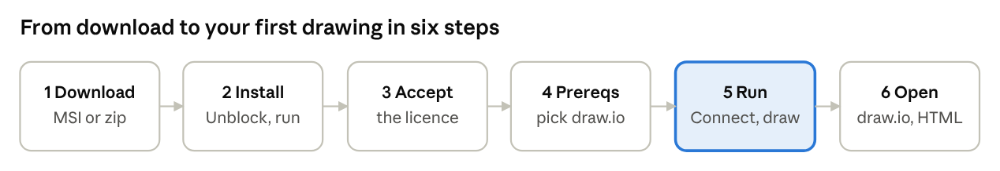

Steps 1–4 happen once per computer (step 3 once per user); after that, every run is step 5. Sections 4 and 5 walk through each step with screenshots.

### About this manual

This manual covers version **3.0.5**. Screenshots marked *Lab* come from the as-built test of a new Windows Server 2022 domain controller (`ad.shenukafernando.com`, one DC, functional level 2016) on 30 September 2026. Screenshots marked *Sample* come from the built-in Contoso test forest.

Project page and downloads: [github.com/shenukaf69/ADTD-Modern-3.0](https://github.com/shenukaf69/ADTD-Modern-3.0) · [Latest release](https://github.com/shenukaf69/ADTD-Modern-3.0/releases/latest)

## 2. How it works

ADTD Modern is a PowerShell module with a Windows front end: it reads AD with read-only LDAP searches, assesses what it read, then writes drawings and reports. Nothing runs or is installed on the domain controllers.

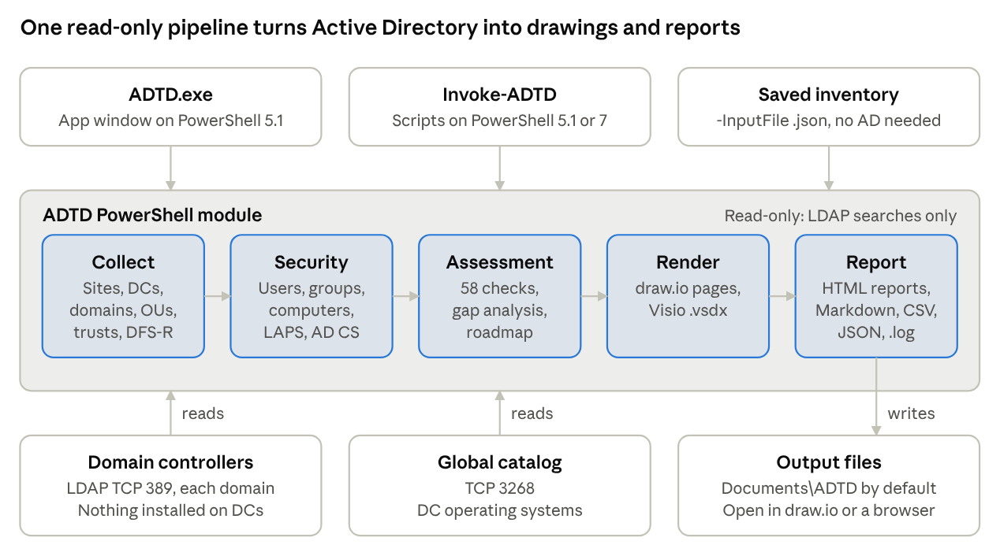

The app, a script, or a saved `.json` inventory all feed the same module; a saved inventory skips the reads and goes straight to the assessment.

### What happens in a run

1. **Connect.** Finds a DC (or uses the one you typed), reads RootDSE, and signs in as you or as the account you entered.
2. **Collect.** Reads sites, subnets, site links, DCs and their FSMO roles, replication connections, domains, trusts, partitions, OUs and GPO links, DFS-R and Exchange. DC operating systems come from the global catalog, or from each DC's own computer account when the global catalog leaves them out.
3. **Security scan.** Reads users, groups, computers, password policy, LAPS schema, certificate templates and hybrid identity objects (Entra Connect, Cloud Sync, AD FS, Seamless SSO, device registration).
4. **Assess.** Runs the 58 checks, then builds the gap analysis, the target hybrid topology and the four-phase roadmap.
5. **Render.** Lays out each page and writes the `.drawio` file (and `.vsdx` when Visio is chosen).
6. **Report.** Writes HTML, Markdown, CSV, JSON and the `.log`, then opens the results if asked.

### Components

| File | Role |
| --- | --- |
| `ADTD.exe` | The app: hosts Windows PowerShell 5.1, loads the module and opens the window, with its own taskbar icon |
| `ADTD.psd1`, `ADTD.psm1`, `ADTD.ps1` | Module manifest, `Invoke-ADTD`, and the entry script |
| `ADTD.Gui.ps1` | Window, About, licence and welcome screens (Windows Forms) |
| `ADTD.Collect.ps1` | Topology over LDAP (System.DirectoryServices) |
| `ADTD.Security.ps1` | Security and hybrid identity scan |
| `ADTD.Assessment.ps1` | Check catalog, gap analysis, target topology, roadmap |
| `ADTD.Render.ps1`, `ADTD.Icons.ps1` | Page layouts, 29 embedded icons, draw.io and Visio writers |
| `ADTD.Report.ps1` | HTML, Markdown, CSV, JSON and draw.io web links |
| `ADTD.Versions.ps1` | Windows, Exchange, schema and functional level tables |
| `lib\mxClient.min.js` | Built-in offline diagram viewer for the HTML reports (mxGraph 4.2.2) |
| `Install-Prerequisites.ps1`, `LICENSE.txt`, `README.html` | Prerequisites checker, licence and read-me |

## 3. System requirements and prerequisites

On Windows 10/11 or Windows Server 2016 and later, everything ADTD Modern needs is already built in: you only need a domain user account, network access to a domain controller, and a way to view draw.io files. Nothing has to be installed on the domain controllers.

### Required

| Prerequisite | Minimum | Why ADTD needs it | Already there? |
| --- | --- | --- | --- |
| **Windows, 64-bit** | Windows 10/11, Windows Server 2016, 2019, 2022, 2025 | The installer and `ADTD.exe` are 64-bit Windows programs | Yes |
| **Windows PowerShell 5.1** | 5.1 | The app window (`ADTD.exe`) hosts Windows PowerShell 5.1 and runs the ADTD module inside it | Yes, on all supported Windows |
| **.NET Framework** | 4.5.2 or later (4.8 recommended) | `ADTD.exe` is a .NET Framework 4 program, and Windows PowerShell 5.1 runs on .NET Framework. `System.DirectoryServices` (the LDAP reader) and Windows Forms (the window) are part of it | Yes: Windows Server 2016 ships 4.6.2; later Windows ships 4.8 |
| **Domain user account** | Any enabled account in the forest | ADTD only reads AD with LDAP searches. Lab tests show an ordinary user and a Domain Admin get identical results | You sign in with it, or enter it in the window |
| **Network to a DC** | TCP 389 (LDAP), TCP 3268 (global catalog) | 389 reads each domain; 3268 reads DC operating systems across the forest. DNS (53) and Kerberos (88) are used as for any domain sign-in | Normal inside a domain |
| **A draw.io viewer** | draw.io desktop, or a browser for draw.io on the web | To open and edit the `.drawio` drawings | Choose in **Prerequisites** (section 4) |

### Optional

| Item | When you need it |
| --- | --- |
| **PowerShell 7.4 or later** (7.6 LTS recommended) | Only to run `Invoke-ADTD` from `pwsh`. It brings its own .NET (7.4: .NET 8, 7.5: .NET 9, 7.6: .NET 10). The app itself always uses Windows PowerShell 5.1 |
| **draw.io desktop** | Computers without internet access, or when you prefer an installed editor. Free from [drawio.com](https://www.drawio.com/) / [GitHub releases](https://github.com/jgraph/drawio-desktop/releases) |
| **Internet access** | Only for draw.io on the web (`app.diagrams.net`). The app, the assessment and the HTML reports' built-in diagram viewer work offline |
| **Visio desktop** (2013–2024 or Plan 2) | Only for `.vsdx` output. Needs a Visio licence |
| **Local administrator** | Only to install the MSI for all users. Without admin rights, use the per-user install (section 4) |
| **Domain membership** | Not required. From a non-joined computer, enter a DC name and a domain account in the window |

### Not needed

RSAT, the ActiveDirectory PowerShell module, .NET Framework 2.0/3.5, Visio, agents on the DCs, schema changes, or any service account.

## 4. Installation

The MSI is the recommended way to install: it puts ADTD Modern in `C:\Program Files\WindowsPowerShell\Modules\ADTD` for all users, adds Start menu shortcuts and upgrades older versions in place. It needs local admin rights.

### Choose a package

| Package | Use it when | Admin? |
| --- | --- | --- |
| `ADTD_Modern_Setup_3.0.5.msi` | Normal install on a computer with or without internet | Yes |
| `ADTD-Modern-3.0.5-offline.zip` | The target computer has no internet. Contains the MSI, the per-user installer, a draw.io installer folder and `START-HERE.txt` | Depends on the method inside |
| `setup\Install-ADTD.ps1` (in the zip) | You have no admin rights. Installs to `Documents\WindowsPowerShell\Modules\ADTD` for the current user | No |

Download both from the [latest release](https://github.com/shenukaf69/ADTD-Modern-3.0/releases/latest). On computers without internet, download on another machine and copy the files across (the lab used a VMware shared folder).

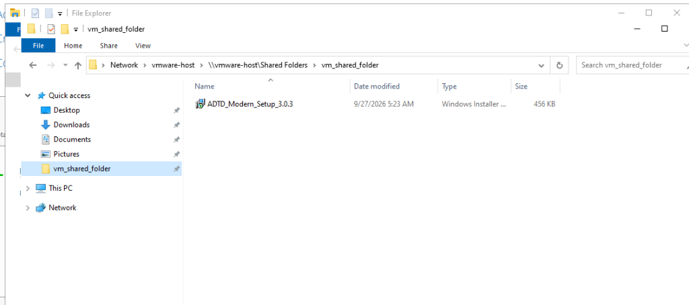

*Lab: the installer copied to the server through a VMware shared folder.*

### Install with the MSI

1. Right-click the MSI → **Properties** → tick **Unblock** → **OK**. This removes the "downloaded from the internet" mark.
2. Double-click the MSI. Windows SmartScreen may say **Windows protected your PC**, because the installer is not code-signed yet. Click **More info** → **Run anyway**.
3. Accept the Windows UAC prompt. The install takes a few seconds.
4. The first time ADTD Modern opens, it shows the **licence** with **I accept** / **Decline**. Accept to continue; the answer is remembered for your Windows account.
5. The **welcome screen** shows where ADTD Modern is installed and offers a desktop shortcut, a taskbar pin and **Open ADTD Modern now**.

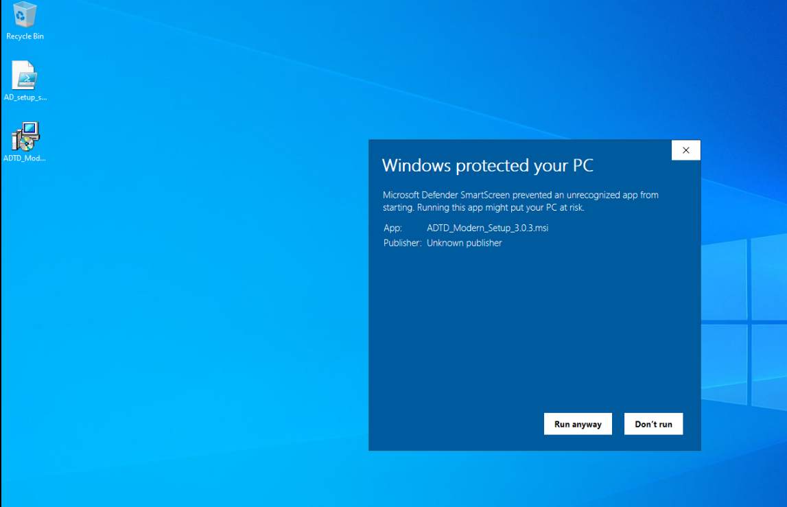

*Lab: SmartScreen on first run of the unsigned MSI. Use More info → Run anyway.*

After installing, the Start menu has an **ADTD Modern** folder with four shortcuts:

| Shortcut | Opens |
| --- | --- |
| **ADTD Modern** | The app (`ADTD.exe`) |
| **ADTD Modern - Prerequisites (draw.io, Visio)** | The prerequisites checker (next step) |
| **ADTD Modern - Read me** | The offline read-me page |
| **ADTD Modern (PowerShell)** | A PowerShell window with the ADTD module loaded, for `Invoke-ADTD` |

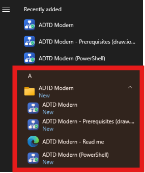

*Lab: the ADTD Modern Start menu folder.*

### Run the prerequisites checker

Open **Start → ADTD Modern - Prerequisites**, or **Prerequisites** in the app's header. It checks Windows, PowerShell, domain membership, read access to AD, ports 389 and 3268, draw.io, winget, Visio and the module, then asks what to install:

| Choice | What it does |
| --- | --- |
| **1** | Install draw.io desktop (winget, the signed GitHub installer, or a local installer from the offline package's `drawio` folder) |
| **2** | Use draw.io on the web: nothing to install; ADTD opens drawings at app.diagrams.net |
| **3** | Install PowerShell 7 (optional) |
| **4** | Install Visio desktop with the Office Deployment Tool (optional, needs a licence) |

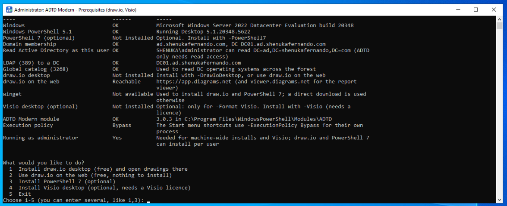

*Lab: every required item OK; draw.io desktop not installed; draw.io web reachable.*

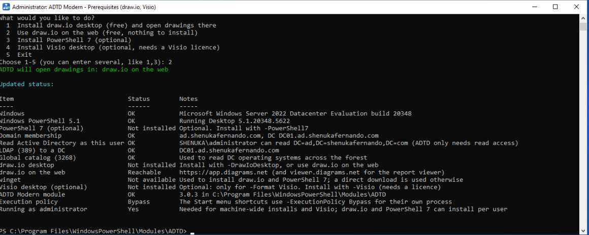

*Lab: option 2 chosen, "ADTD will open drawings in: draw.io on the web".*

### Other ways to install

- **Silent install** (software deployment): `msiexec /i ADTD_Modern_Setup_3.0.5.msi /qn`. The licence is then shown the first time each user opens the app.
- **Per-user, no admin:** in the offline package, run `powershell -ExecutionPolicy Bypass -File setup\Install-ADTD.ps1` (add `-DesktopShortcut` for a desktop icon).
- **Upgrade:** run the newer MSI. It replaces the old version; there is no need to uninstall first.
- **Uninstall:** Settings → Apps → **ADTD Modern 3.0**, or `msiexec /x ADTD_Modern_Setup_3.0.5.msi /qn`. Per-user: `Install-ADTD.ps1 -Uninstall`.

## 5. Using the app

One run takes four steps in one window: connect, choose what to draw, choose formats, then click **Draw my Active Directory**. Run time grows with the number of users and computers, because the security scan reads each one once.


*Sample: the window, with its four numbered cards, progress bar and status bar.*

### Step 1: Connect to Active Directory

1. **Domain or domain controller:** leave it empty to read the domain you are signed in to. Otherwise type a domain (`contoso.com`) or a DC (`dc01.contoso.com`).
2. **Sign in as:**
   - **My Windows account** uses the account you are signed in with.
   - **A different account** shows a user name and password box. Enter `DOMAIN\user` or `user@domain`. The password is used for this run only and is never saved.
3. Click **Test connection**. A green line names the DC that answered and the account used.

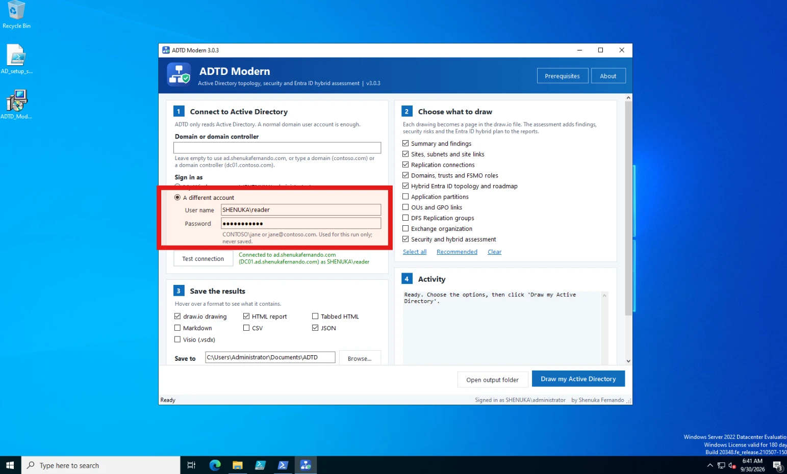

*Lab: "Connected to ad.shenukafernando.com (DC01.ad.shenukafernando.com) as SHENUKA\\reader", an ordinary Domain Users account.*

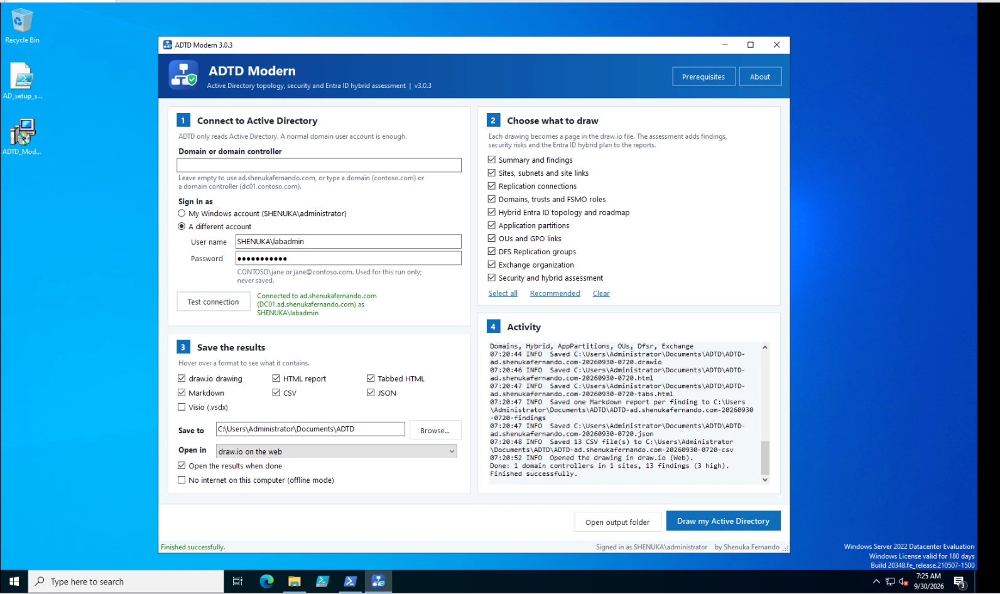

*Lab: signed in to Windows as Administrator, running as SHENUKA\\labadmin with A different account.*

### Step 2: Choose what to draw

Tick the pages you want. **Recommended** selects Summary, Sites, Replication, Domains and the Hybrid pages; **Select all** adds Application partitions, OUs and GPO links, DFS Replication and Exchange; **Clear** unticks everything. The security and hybrid assessment runs unless you untick it (topology only).

### Step 3: Save the results

| Option | What it does |
| --- | --- |
| **Formats** | draw.io drawing, HTML report, Tabbed HTML, Markdown, CSV, JSON, Visio (.vsdx). Hover a format to see what it contains |
| **Save to** | Output folder. Default `Documents\ADTD` |
| **Open in** | draw.io desktop, draw.io on the web, or Auto (desktop if installed, else web) |
| **Open the results when done** | Opens the report and the drawing at the end |
| **No internet on this computer (offline mode)** | No draw.io web links; drawings open in draw.io desktop |

### Step 4: Run and watch the Activity log

Click **Draw my Active Directory**. The Activity card logs each read and each file saved, and the progress bar moves. When the run ends, a message says **ADTD finished successfully** with the summary and the output folder, and the status bar turns green. Errors show in red in the status bar and the log.


*Lab: "1 domain controllers in 1 sites, 13 findings (3 high). Results are saved in C:\\Users\\Administrator\\Documents\\ADTD".*

### About and the licence

**About** (top right) shows the version, author, install location with **Open folder**, buttons to add a desktop shortcut and pin to the taskbar, the copyright and third-party notices, and **View licence**.


*Sample: About ADTD Modern.*

## 6. Outputs

Every run writes a set of files named `ADTD-<forest>-<yyyyMMdd-HHmm>` to the output folder (default `Documents\ADTD`). Start with the drawing and the HTML report; the CSV and JSON files are for further analysis.

| File | What it is |
| --- | --- |
| `.drawio` | All requested drawing pages in one file. Opens in draw.io desktop or on the web |
| `-open-in-drawio-web.url` | Shortcut that opens the drawing in draw.io on the web. The drawing travels in the link's `#` part, which browsers never send to a server |
| `.html` | Assessment report on one page, with the built-in offline diagram viewer |
| `-tabs.html` | The same report with tabs: Summary, Findings (filter and search), Diagrams, Hybrid plan, Inventory |
| `-findings\*.md` | One Markdown report per finding, plus `README.md` and `hybrid-plan.md` |
| `-csv\*.csv` | Findings, evidence, gap analysis, roadmap, security by domain, user account summary, computer OS counts, DCs, domains, sites, subnets, site links, connections, trusts, Exchange, OUs |
| `.json` | The whole inventory. Re-assess it later, without AD, with `Invoke-ADTD -InputFile` |
| `.vsdx` | Visio drawing (only with the Visio format and Visio installed) |
| `.log` | Everything that was read, and anything that could not be read. Check it first if a page looks incomplete |

### The drawing pages

| Page | What it shows |
| --- | --- |
| **Summary** | Tiles for domains, sites, DCs, high findings, enabled users and directory sync, plus the findings list |
| **Sites and site links** | Each site with its DCs (roles, OS, support status), subnets and site links with cost |
| **Replication** | Replication connections between DCs: automatic (KCC), manual and disabled |
| **Domains and trusts** | Forest and domains, functional levels, schema version, FSMO roles and trusts |
| **Target hybrid topology** | Today's AD, the identity bridge (Entra Connect or Cloud Sync) and the Entra ID target, coloured by readiness |
| **Upgrade roadmap** | Four phases with the findings that belong to each |
| **Application partitions** | DomainDnsZones, ForestDnsZones and other partitions with their replicas |
| **OUs and GPO links** | OU tree with linked GPOs: enforced, disabled, missing and blocked inheritance |
| **DFS Replication** | DFS-R groups, including SYSVOL, with members |
| **Exchange** | Exchange organisation, servers by site, versions and DAGs, when Exchange is present |


*Lab: Summary page. 1 domain, 1 site, 1 DC, 3 high findings, 3 of 5 users enabled, no directory sync.*

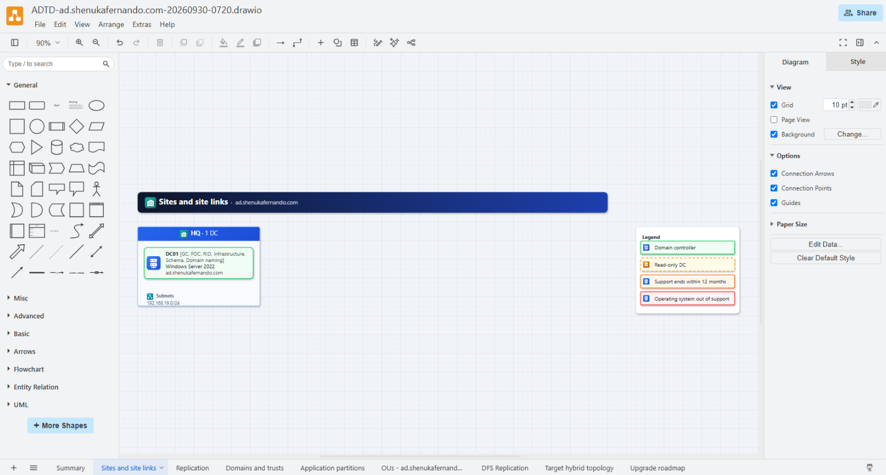

*Lab: Sites and site links. HQ with DC01 (all FSMO roles, Windows Server 2022) and subnet 192.168.19.0/24.*

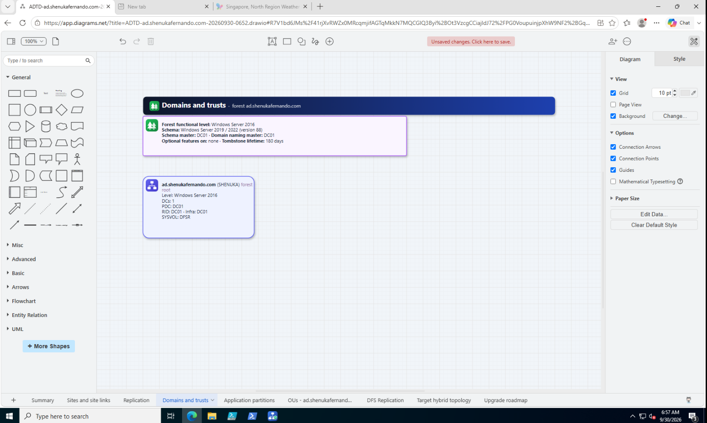

*Lab: Domains and trusts.*


*Lab: Target hybrid topology. Domain controllers "0 need replacing" in green; no directory sync yet.*

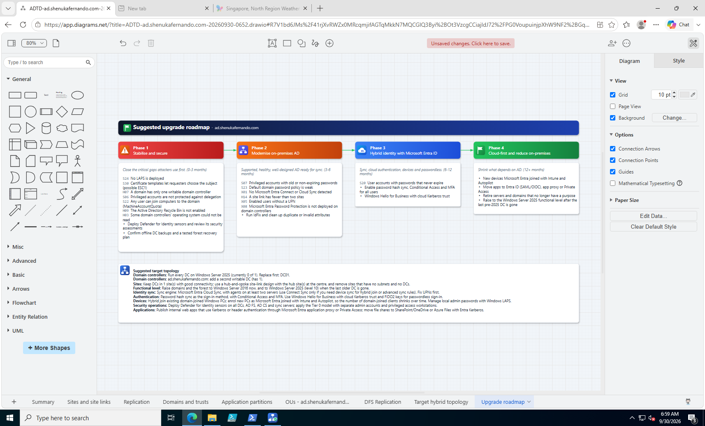

*Lab: Upgrade roadmap in four phases.*

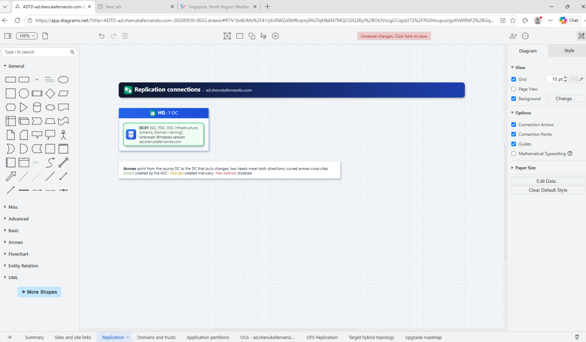

*Lab: Replication. One DC, so no connections.*

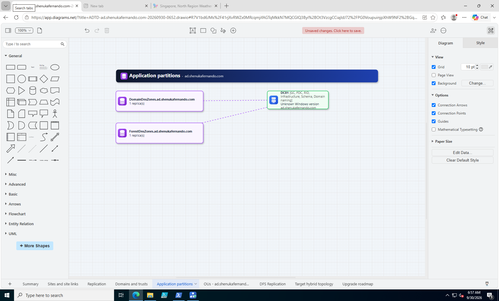

*Lab: Application partitions.*

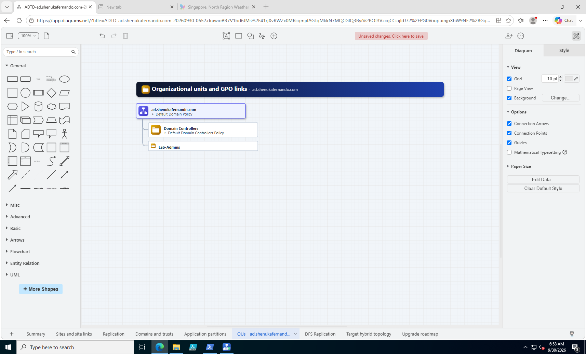

*Lab: OUs and GPO links.*

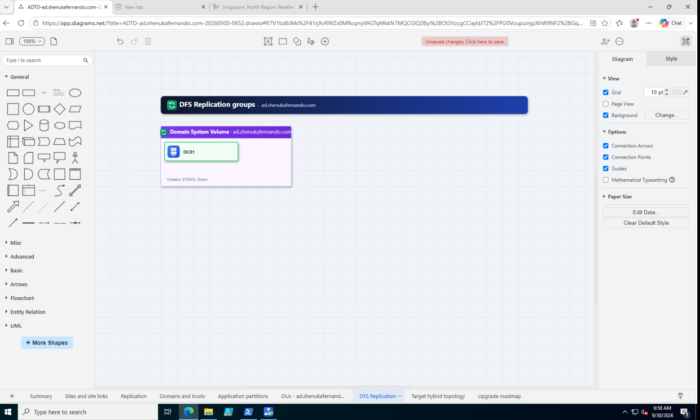

*Lab: DFS Replication, the Domain System Volume (SYSVOL) on DC01.*

### The HTML reports

The report opens in any browser and works offline. Each finding has its severity, evidence, why it matters, steps to fix and Microsoft Learn links. The tabbed report adds filters and search.

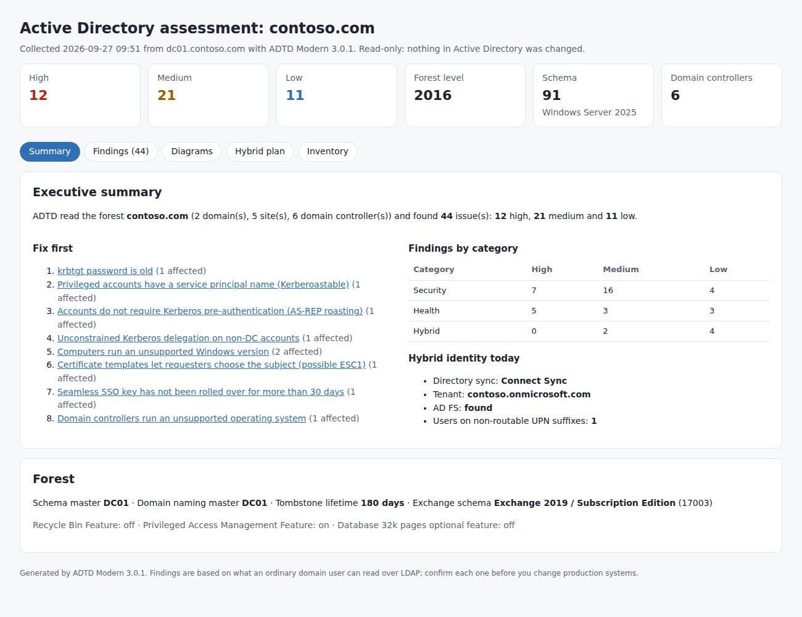

*Sample: report summary.*


*Sample: Findings tab with filter and search.*

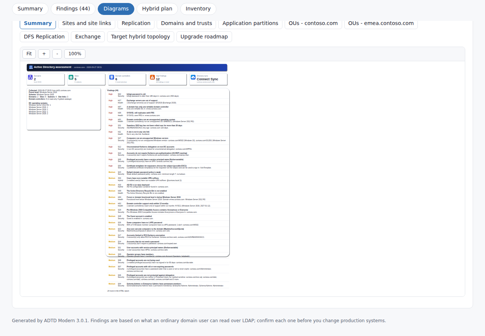

*Sample: Diagrams tab, drawn by the built-in viewer.*


*Sample: Hybrid plan tab with the gap analysis and roadmap.*

### CSV files

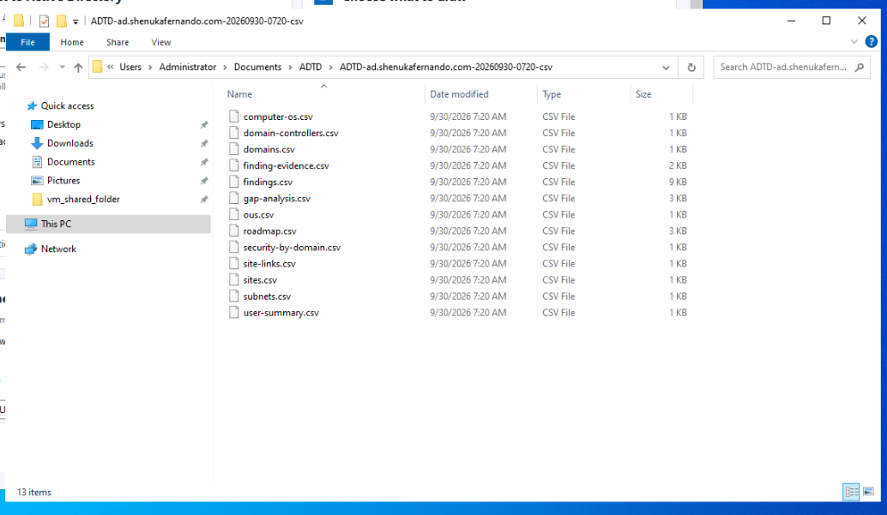

*Lab: 13 CSV files. A CSV with no rows (for example Exchange servers, trusts or site connections in a one-DC lab) is not written.*

`user-summary.csv` gives account counts per domain with no names: total, enabled, disabled, stale for 90 days, password never expires, password not required, no Kerberos pre-authentication, with SPN, privileged, SID history, RC4 only, reversible encryption, unconstrained delegation and no UPN.

## 7. Assessment and findings

ADTD runs 58 checks and reports only the ones that apply, each with evidence (the affected objects), why it matters, numbered steps to fix and Microsoft Learn references. The full catalog is in [docs/FINDINGS.md](FINDINGS.md).

| Family | ID | Checks | High | Medium | Low | Examples |
| --- | --- | --- | --- | --- | --- | --- |
| Health and topology | H01–H18 | 18 | 5 | 5 | 8 | Unsupported DC operating system, one writable DC per domain, FRS still in use, Recycle Bin off, sites without links or subnets |
| Security | S01–S32 | 32 | 9 | 19 | 4 | Old krbtgt password, Kerberoastable and AS-REP-roastable accounts, unconstrained delegation, no LAPS, ESC1 certificate templates, weak password policy |
| Hybrid readiness | X01–X08 | 8 | 0 | 3 | 5 | No Entra Connect or Cloud Sync, non-routable UPN suffixes, AD FS in use, no Entra Password Protection |

**Severity:** **High** = fix first; attackers or outages use it directly. **Medium** = plan a fix (suggested: within the next quarter). **Low** = hygiene or readiness work.

### Upgrade roadmap

Every finding is placed in one of four phases. The drawing's **Upgrade roadmap** page and the report's **Hybrid plan** list each phase's tasks:

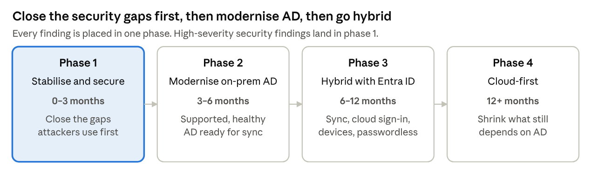

### Example: the lab results

The new Windows Server 2022 lab domain produced 13 findings. Most are expected for a fresh, single-DC lab:

| ID | Severity | Finding | Why in the lab |
| --- | --- | --- | --- |
| H07 | High | A domain has only one writable domain controller | Single-DC lab by design |
| S30 | High | Certificate templates let requesters choose the subject (possible ESC1) | Lab-ESC1 was published on purpose; SubCA is a built-in template |
| S24 | High | No LAPS is deployed | LAPS schema not extended |
| S23 | Medium | Default domain password policy is weak | Default minimum length 7, no lockout |
| H09 | Medium | The Active Directory Recycle Bin is not enabled | Not enabled after promotion |
| X01 | Medium | No Microsoft Entra Connect or Cloud Sync detected | No sync installed |
| S06 | Medium | Privileged accounts are not protected against delegation | Administrator and labadmin not in Protected Users |
| S07 | Medium | Privileged accounts with old or non-expiring passwords | Administrator password never expires |
| S22 | Medium | Any user can join computers to the domain (MachineAccountQuota) | Default quota 10 |
| X05 | Low | Enabled users without a UPN | Built-in Administrator |
| X08 | Low | Microsoft Entra Password Protection is not deployed | No DC agent |
| S20 | Low | User accounts with passwords that never expire | Administrator |
| H14 | Low | A site link has fewer than two sites | DEFAULTIPSITELINK with one site |

Some items cannot be seen over LDAP (GPO settings, ACLs, services, Entra ID). They appear under **Check by hand** in the report, each with its Microsoft article: LDAP signing and channel binding, Print Spooler on DCs, the forest recovery guide and Entra emergency access accounts.

## 8. Command line and offline use

Everything the window does is also available as `Invoke-ADTD`, for scheduled runs, scripts and computers without a desktop. Open **Start → ADTD Modern (PowerShell)**, or run `Import-Module ADTD` in Windows PowerShell 5.1 or PowerShell 7.

```powershell
# Defaults: Summary, Sites, Replication, Domains, Hybrid -> draw.io + HTML + JSON
Invoke-ADTD

# Everything, every format, open the results
Invoke-ADTD -All -Format DrawIo, Html, HtmlTabs, Markdown, Csv, Json -Open

# Another domain or forest, with another account
Invoke-ADTD -Server dc01.contoso.com -Credential (Get-Credential)

# Topology only, more OUs
Invoke-ADTD -Drawings Sites, OUs -MaxOUs 1000 -SkipSecurityScan

# Re-assess a saved inventory without contacting AD
Invoke-ADTD -InputFile .\ADTD-contoso.com-20260927-1015.json -Format HtmlTabs, Markdown

# No internet on this computer
Invoke-ADTD -All -Offline -Format DrawIo, HtmlTabs -Open

# Full help
Get-Help Invoke-ADTD -Full
```

| Parameter | What it does | Default |
| --- | --- | --- |
| `-Drawings` | `Summary`, `Sites`, `Replication`, `Domains`, `Hybrid`, `AppPartitions`, `OUs`, `Dfsr`, `Exchange` | Summary, Sites, Replication, Domains, Hybrid |
| `-All` | Every drawing |  |
| `-Format` | `DrawIo`, `Html`, `HtmlTabs`, `Markdown`, `Csv`, `Json`, `Visio` | DrawIo, Html, Json |
| `-DrawIoViewer` | Where `-Open` shows drawings: `Desktop`, `Web`, `Auto` | Saved setting (Auto) |
| `-SkipSecurityScan` | Health and topology only |  |
| `-Offline` | No draw.io web links; open drawings in draw.io desktop |  |
| `-NoDrawIoWeb` | Leave out the draw.io web link and shortcut |  |
| `-DrawIoWebViewer` | Use draw.io's online viewer in the HTML reports instead of the built-in one |  |
| `-OutputFolder` | Where files go | `Documents\ADTD` |
| `-Server`, `-Credential` | DC or domain, and the account to read with | Logon domain and account |
| `-InputFile` | Re-assess and redraw a saved `.json` |  |
| `-MaxOUs` | OUs drawn per domain | 400 |
| `-Open` | Open the report and drawing when done |  |

### Computers without internet access

1. On a computer with internet, download `ADTD-Modern-3.0.5-offline.zip` and, optionally, the draw.io desktop installer from [github.com/jgraph/drawio-desktop/releases](https://github.com/jgraph/drawio-desktop/releases). Put the installer in the zip's `drawio` folder.
2. Copy the zip to the target computer, unblock it (Properties → Unblock) and extract it.
3. Follow `START-HERE.txt`: install the MSI (or `Install-ADTD.ps1` without admin), then run **Prerequisites** and choose **1** to install draw.io from the local installer.
4. Tick **No internet on this computer (offline mode)** in the window, or use `-Offline`.

The HTML reports' diagram viewer is built in (mxGraph 4.2.2), so diagrams display without internet. Step-by-step guide: [docs/OFFLINE.md](OFFLINE.md).

## 9. Security and permissions

ADTD Modern never writes to Active Directory: every read is an LDAP search that an ordinary domain user is allowed to run. In the lab, the `reader` account (Domain Users only) and `labadmin` (Domain Admins) produced identical results: 5 users, 3 enabled, 2 privileged, 13 findings.

| What ADTD reads | What ADTD does not read or do |
| --- | --- |
| Configuration partition: sites, subnets, site links, replication connections, partitions, Exchange organisation, certificate templates and CAs | Passwords, password hashes or LAPS passwords (only whether a LAPS password attribute exists) |
| Each domain: domain object, password policy, trusts, OUs and GPO links, DFS-R objects | GPO settings, file shares, registry, services or event logs |
| Users, computers and groups: account flags, last logon, SPNs, delegation, encryption types, group membership | ACLs (for example AD CS enrolment rights or AdminSDHolder) |
| Global catalog: DC computer accounts and their operating systems | Anything in Microsoft Entra ID or Microsoft 365 |
| Schema: version and whether LAPS attributes exist | Any change to AD, DNS, DCs or the computer it runs on (apart from writing its output files) |

### Credentials and data

- **A different account:** the password typed in the window is used for that run only, kept in memory as a secure string, and never written to disk or settings.
- **Output files contain directory data** (account names, group membership, DC names, findings). Store and share them like any other internal security report.
- **draw.io on the web:** the drawing travels in the link's `#` fragment, which browsers do not send to any server; draw.io decodes it in your browser. Use offline mode if your policy forbids opening internal data in a web app.
- **Settings** (draw.io viewer choice, licence accepted, welcome shown) are saved per user in `%APPDATA%\ADTD\settings.json`.
- **Code signing:** the 3.0.5 installer and scripts are not signed yet, so SmartScreen warns on first run. Where `AllSigned` is enforced, sign the scripts with your own certificate ([docs/DEVELOPMENT.md](https://github.com/shenukaf69/ADTD-Modern-3.0/blob/main/docs/DEVELOPMENT.md)).

## 10. Compatibility

Run ADTD Modern on Windows Server 2016 or later, or Windows 10/11; it can read forests whose DCs run anything from Windows 2000 Server to Windows Server 2025. For an old domain, run ADTD from a supported computer and point it at the old DCs.

### Where ADTD can run

| Computer running ADTD | Supported | Notes |
| --- | --- | --- |
| Windows Server 2025, 2022, 2019, 2016 | Yes | Windows PowerShell 5.1 and .NET Framework 4.6.2+ built in. Lab-tested on Server 2022 |
| Windows 11, Windows 10 (64-bit) | Yes | Built in |
| Windows Server 2012 R2, 2012 | With WMF 5.1 | Install [WMF 5.1](https://learn.microsoft.com/powershell/scripting/windows-powershell/wmf-overview#wmf-availability-across-windows-operating-systems) and .NET Framework 4.5.2+ first. Not lab-tested |
| Windows Server 2008 R2 SP1 | With WMF 5.1 | Same as above. Out of Microsoft support. Not lab-tested |
| Windows Server 2008, 2003, 32-bit Windows | No | WMF 5.1 is not available; the MSI is 64-bit |

### PowerShell

| Engine | Supported | Used for |
| --- | --- | --- |
| Windows PowerShell 5.1 | Yes | The app (`ADTD.exe`) and `Invoke-ADTD` |
| PowerShell 7.6 LTS, 7.5, 7.4 | Yes | `Invoke-ADTD` from `pwsh` ([support lifecycle](https://learn.microsoft.com/powershell/scripting/install/powershell-support-lifecycle)) |
| PowerShell 7.0–7.3, 6.x | Not supported | Out of support |
| Windows PowerShell 2.0–5.0 | No | The module needs 5.1 |

Every change is tested automatically on Windows PowerShell 5.1, PowerShell 7 on Windows and PowerShell 7 on Linux (149 offline checks).

### What ADTD can read and recognise

| Item | Range |
| --- | --- |
| Domain controller OS | Windows 2000 Server to Windows Server 2025 (build 26100) |
| Member computers | Windows Server 2003–2025, Windows 7/8.1/10/11, LTSB/LTSC |
| Forest and domain functional level | 0–7 and 10 (Windows Server 2025) |
| AD schema | 13 to 91 (Windows Server 2025) |
| Exchange | 2000 to Exchange Server Subscription Edition |
| draw.io | Current draw.io desktop, app.diagrams.net, VS Code Draw.io Integration |
| Visio (optional) | Visio 2013–2024 and Visio Plan 2 desktop |

## 11. Frequently asked questions

**Does ADTD change anything in Active Directory?** No. It only runs LDAP searches. The only files it writes are its outputs in the folder you choose and its settings file in `%APPDATA%\ADTD`.

**Do I need Domain Admin rights?** No. Any domain user can read what ADTD needs. The lab compared an ordinary user with a Domain Admin and the results were identical.

**Do I need to install anything on the domain controllers?** No. Run ADTD on any domain-joined Windows computer, or on a non-joined one with **A different account** and a DC name.

**Do I need .NET or RSAT?** .NET Framework 4.5.2 or later is needed and is already built into Windows 10/11 and Server 2016+. RSAT and the ActiveDirectory module are not needed.

**Does it work without internet?** Yes. Use the offline package, install draw.io desktop from a local installer, and tick **No internet on this computer**. The HTML reports' diagram viewer works offline.

**Is my data sent anywhere?** No data is uploaded. With draw.io on the web, the drawing is carried in the link's `#` part, which the browser keeps; draw.io decodes it locally. Use offline mode if that is not allowed.

**Can I use it at work or for a client?** Yes. The ADTD Modern Licence allows free use at work and for client assessments, and you may charge for your own work. Selling, modifying or redistributing the software itself needs the author's written permission.

**Do I need Visio?** No. draw.io desktop and draw.io on the web are free. Visio output is optional.

**Can it read several domains or another forest?** Yes. It reads every domain in the forest it connects to. For another forest, enter one of its DCs and an account from that forest, or use `-Server` and `-Credential`.

**How long does a run take?** It depends on the number of users and computers: the security scan reads each account once. Use `-SkipSecurityScan` (or untick the assessment) for a quick topology-only run.

**Can I re-run the assessment later without access to AD?** Yes. Keep the `.json` file and run `Invoke-ADTD -InputFile <file>.json`.

**Why does SmartScreen warn when I install it?** The installer is not code-signed yet. Unblock the file, then choose **More info → Run anyway**.

**Why does the app ask me to accept a licence?** The first time each user opens 3.0.5 or later, the app shows the licence once. Your answer is saved in your settings; you are asked again only if the licence changes.

**Where are my results?** `Documents\ADTD` by default. Click **Open output folder** in the window.

## 12. Troubleshooting

Start with the `.log` file next to the results: it lists every read and anything that failed. Most problems are a blocked port, an account that cannot reach a domain, or a blocked web viewer.

### Installing and starting

| Symptom | Cause | Fix |
| --- | --- | --- |
| SmartScreen: "Windows protected your PC", Unknown publisher | The MSI is not code-signed | Properties → Unblock, then More info → Run anyway |
| "ADTD Modern needs 64-bit Windows…" when installing | 32-bit Windows, or an old OS | Use 64-bit Windows 10/11 or Server 2016+; on 2012 R2/2012/2008 R2 SP1 install WMF 5.1 first |
| "A newer version of ADTD Modern is already installed" | Installing an older MSI over a newer one | Uninstall the newer version first, or keep it |
| The app closes after **Decline** on the licence | The licence must be accepted to use the app | Open it again and choose **I accept** |
| `ADTD.exe` says Windows PowerShell 5.1 is missing | The Windows PowerShell feature is turned off | Turn it on in Windows Features, or run `Invoke-ADTD` in PowerShell 7 |
| Taskbar shows the PowerShell icon | `ADTD.ps1` was started directly | Start **ADTD Modern** from the Start menu (`ADTD.exe`) |
| Scripts blocked where `AllSigned` is enforced | Scripts are not signed | Sign them with your own certificate (docs/DEVELOPMENT.md) |

### Connecting and reading AD

| Symptom | Cause | Fix |
| --- | --- | --- |
| `Could not read RootDSE` / Test connection fails | No DC reachable on TCP 389, wrong name, or wrong password | Type a DC name, check TCP 389, check the account, or run from a domain-joined computer |
| DCs show "OS could not be read" | Global catalog TCP 3268 blocked | Open 3268 to a GC, or run from a site with a GC |
| A domain shows "could not be read" | The account has no access to that domain | Run with an account from that forest (`-Credential`) |
| "Not found: Exchange organization / AD FS / LAPS schema" in the log | That component is not deployed | Information only, not an error |
| Large domain is slow | The security scan reads every user and computer | Use `-SkipSecurityScan` for topology only, or run outside business hours |

### Viewing the results

| Symptom | Cause | Fix |
| --- | --- | --- |
| The draw.io web link does not open | A browser policy or proxy blocks app.diagrams.net | Install draw.io desktop, or use offline mode |
| Report says "viewer could not load" | `-DrawIoWebViewer` was used without internet | Run without that switch to use the built-in viewer, or open the `.drawio` file in draw.io desktop |
| Visio output fails | Visio not installed, or installed for another user | Use draw.io, or install Visio with the prerequisites script |
| A page is empty (Replication, Exchange) | Nothing to draw: one DC, or no Exchange | Expected |

### Fixed in 3.0.4 (upgrade if you see these)

These were found during the lab test on Windows Server 2022 and are fixed from version 3.0.4:

| Symptom in 3.0.3 | Fix |
| --- | --- |
| "Exception calling EscapeDataString… The Uri string is too long" after the `.drawio` file is saved | Upgrade to 3.0.4 or later, or tick offline mode |
| Every DC shows "Unknown Windows version" and "1 need replacing" | Upgrade to 3.0.4 or later |
| Log warnings ending "exception while retrieving member Dispose" | Upgrade; missing components are now logged as "Not found" |
| "The property ' $\_.Computers.LapsEligible ' cannot be found" when closing the window | Upgrade; the LAPS coverage check now runs in Windows PowerShell 5.1 |

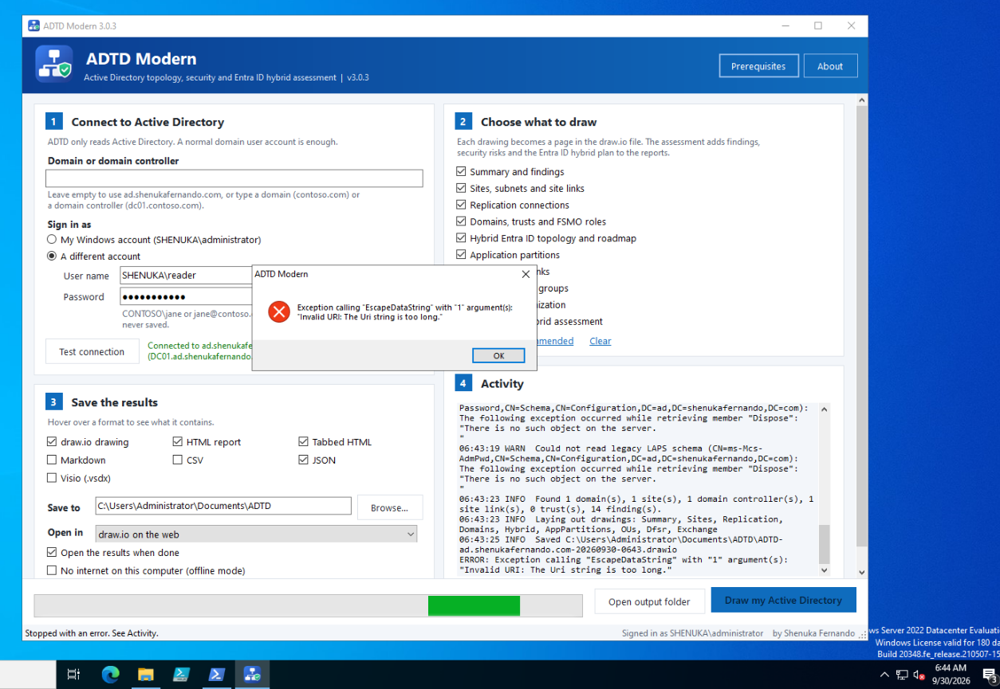

*Lab: the 3.0.3 error, fixed in 3.0.4.*

### Still stuck?

Open an issue at [github.com/shenukaf69/ADTD-Modern-3.0/issues](https://github.com/shenukaf69/ADTD-Modern-3.0/issues) with the ADTD version (About), Windows and PowerShell versions, and the `.log` file with names removed if needed.

## 13. Version history, licence and author

### Version history

| Version | Date | Highlights |
| --- | --- | --- |
| 3.0.5 | 2026-09-30 | ADTD Modern Licence; accept on first run; View licence in About; copyright notice in every source file |
| 3.0.4 | 2026-09-30 | Lab-tested on Windows Server 2022. Fixes: long draw.io web links on PowerShell 5.1, DC OS read from the global catalog, LAPS coverage on 5.1, quieter log. New: user account summary, success message, updated Microsoft references, Compatibility section, CI on PowerShell 5.1 and 7 |
| 3.0.3 | 2026-09-27 | Fixed colour errors when closing the window |
| 3.0.2 | 2026-09-27 | The app (`ADTD.exe`) with its own icon, redesigned window, Test connection, About, welcome screen, automatic GitHub releases |
| 3.0.1 | 2026-09-27 | Works without internet: built-in report viewer, offline package, redesigned diagrams and icon set |
| 3.0.0 | 2026-09-27 | First release: topology drawings, 58 checks, hybrid readiness and roadmap, HTML/Markdown/CSV/JSON outputs, MSI |

Full details: [CHANGELOG.md](https://github.com/shenukaf69/ADTD-Modern-3.0/blob/main/CHANGELOG.md).

### Licence

ADTD Modern is free to use under the [ADTD Modern Licence 1.0](https://github.com/shenukaf69/ADTD-Modern-3.0/blob/main/LICENSE).

| You may, free of charge | You need the author's written permission to |
| --- | --- |
| Install it on any number of computers | Modify it or copy its code into other software |
| Use it at work and for client assessments, and charge for your own work | Sell, rent or sublicense it, or bundle it in a product or service you sell |
| Keep, share and publish the reports and drawings it creates | Publish or distribute it anywhere other than the official project page |
| Give unmodified official installers to others in your organisation | Remove the copyright notices or present it as your own work |

The software is provided as is, without warranty. Third-party: mxGraph 4.2.2 (Apache License 2.0). Microsoft, Active Directory, Microsoft Entra, Exchange, Visio, Windows and Windows Server are trademarks of the Microsoft group of companies; draw.io is a trademark of JGraph Ltd. ADTD Modern is an independent project, not endorsed by Microsoft.

### About the author

ADTD Modern is designed and developed by **Shenuka Fernando**. It rebuilds Microsoft's 2011 Active Directory Topology Diagrammer for today's Windows Server, security practice and Microsoft Entra ID hybrid identity.

- GitHub: [github.com/shenukaf69](https://github.com/shenukaf69)
- Project: [github.com/shenukaf69/ADTD-Modern-3.0](https://github.com/shenukaf69/ADTD-Modern-3.0)
- Questions, permissions and feedback: [open an issue](https://github.com/shenukaf69/ADTD-Modern-3.0/issues) or contact through GitHub

*Open: add a short bio here (role, years of experience, certifications, contact).*

© 2026 Shenuka Fernando. All rights reserved.
